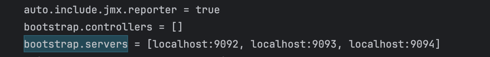
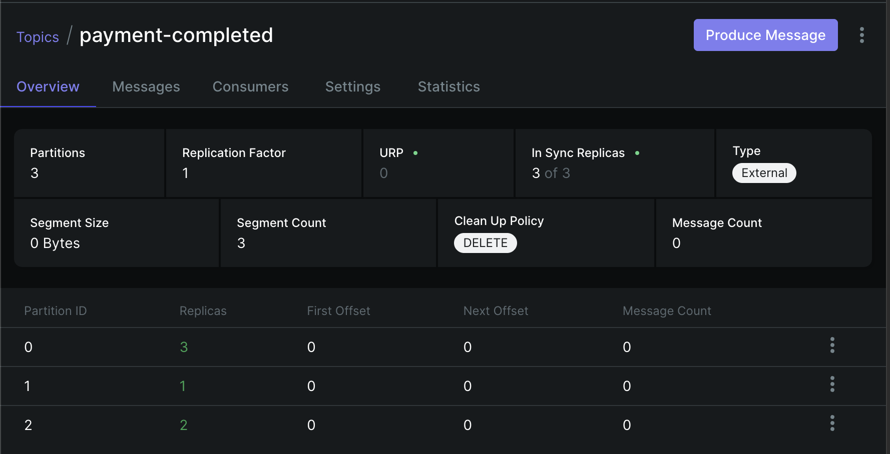
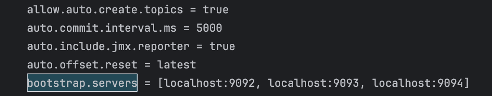

## Kafka 기반 병렬 배송 처리 시스템 개선 프로젝트
- 본 프로젝트는 결제 완료 이벤트를 처리하여 배송 데이터를 생성하고, 실시간 조회를 제공하는 시스템의 성능과 안정성을 개선한 과제입니다. 기존의 단일 처리 구조를 병렬 분산 처리 구조로 개편하여 시스템 확장성을 확보했습니다.

---

## 1. 기존 메시지 처리 구조 분석 및 문제점 (과제 1)


- 구조 특징: 단일 파티션(Partition 0)과 단일 컨슈머 스레드가 1:1로 연결된 구조입니다.

- 병목 지점: 모든 결제 메시지가 하나의 통로로만 처리되어, 이벤트가 급증할 경우 배송 데이터 생성 및 상태 업데이트에 심각한 지연(Lag)이 발생합니다.

- 장애 영향: 단일 컨슈머 스레드에 장애가 발생하면 전체 배송 처리 로직이 중단되는 단일 장애점(SPOF) 문제를 안고 있습니다.

---

## 2. 효율적인 메시지 처리 구조 설계 (과제 2)


- 병렬 경로 확보: 토픽 파티션을 3개로 확장하여 물리적인 데이터 처리 통로를 3배로 늘렸습니다.

- 분산 처리 설계: Concurrency 설정을 통해 3개의 컨슈머 스레드가 각 파티션을 독립적으로 전담하여 동시에 메시지를 처리하도록 설계했습니다.

- 데이터 정합성 유지: orderId를 메시지 키로 사용하여 동일 주문의 이벤트는 항상 같은 파티션에 인입되도록 함으로써, 병렬 처리 중에도 이벤트 순서가 뒤바뀌지 않게 설계했습니다.

---

## 3. 주요 코드 수정 사항 (과제 3)
### 시스템 연결 상태 확인

### ① 토픽 파티션 확장 (KafkaTopics.java)


```java
@Bean
public NewTopic paymentCompletedTopic() {
// 파티션을 3개로 설정하여 병렬 처리의 기반을 마련함
return TopicBuilder.name(TOPIC_PAYMENT_COMPLETED)
.partitions(3)
.replicas(1)
.build();
}
```
---
### ② 컨슈머 병렬화 설정 (KafkaConsumerConfig.java)



```java
@Bean
public ConcurrentKafkaListenerContainerFactory<String, PaymentCompletedEvent> deliveryKafkaListenerContainerFactory() {
ConcurrentKafkaListenerContainerFactory<String, PaymentCompletedEvent> factory = new ConcurrentKafkaListenerContainerFactory<>();
factory.setConsumerFactory(deliveryConsumerFactory());
// 컨슈머 스레드 3개를 동시에 가동하여 처리 속도 향상
factory.setConcurrency(3);
return factory;
}
```
---
### ③ 메시지 키 적용 (PaymentProducer.java & PaymentService.java)
```java

// PaymentService: orderId를 키로 전달
producer.send(event.getOrderId().toString(), event);

// PaymentProducer: 전달받은 키를 KafkaTemplate에 적용
public void send(String key, PaymentCompletedEvent event) {
paymentCompletedEventKafkaTemplate.send(TOPIC_PAYMENT_COMPLETED, key, event);
}
```
---

### 4. 구조 개선의 효율성 및 기술적 근거 (과제 4)


- **처리량 최적화**: 3개의 파티션과 3개의 컨슈머 스레드를 맞춤으로써, 대량의 결제 이벤트를 지연 없이 병렬로 처리합니다.
- **순서 보장 검증**: 위 'Messages' 탭 로그와 같이 동일 주문(Key)에 대해 이벤트가 순차적으로 인입됨을 확인하여 데이터 정합성을 보장했습니다.
- **고가용성 및 모니터링**: UI 대시보드를 통해 3개의 브로커가 모두 'Online' 상태임을 확인하였으며, 장애 시에도 유연한 처리가 가능한 구조임을 입증했습니다. 남은 파티션을 처리할 수 있는 유연한 구조를 갖추었습니다.

---

## 기술 스택
- **Backend**: Java 17, Spring Boot 3.x, Spring Kafka
- **Database**: PostgreSQL, Redis
- **Messaging**: Apache Kafka (3-Broker Cluster), Kafka UI
- **Infrastructure**: Docker, Docker Compose
- **Tools**: Postman (API Testing), Redis Insight (Data Verification)
